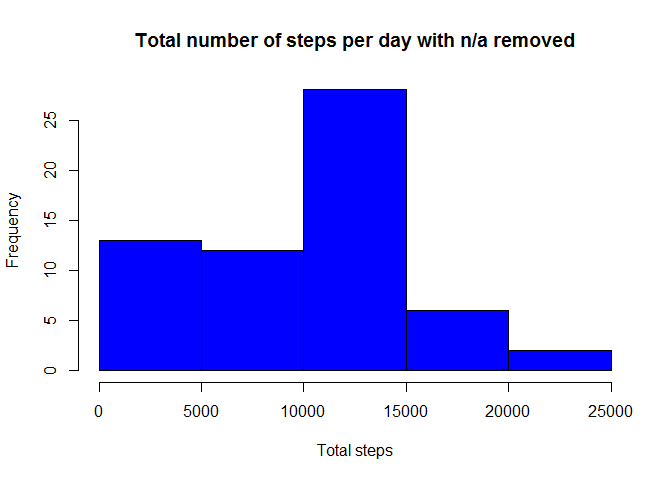
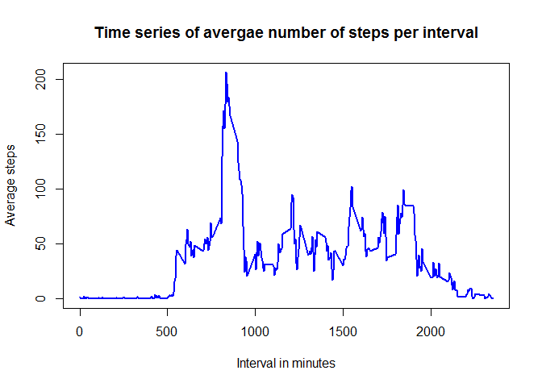
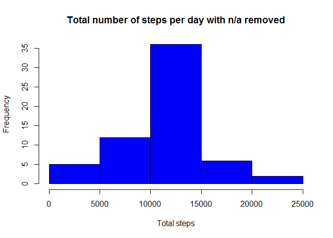
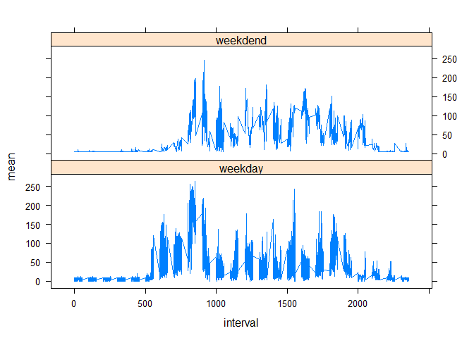

#Introduction
It is now possible to collect a large amount of data about personal movement using activity monitoring devices such as a Fitbit, Nike Fuelband, or Jawbone Up. These type of devices are part of the "quantified self" movement -- a group of enthusiasts who take measurements about themselves regularly to improve their health, to find patterns in their behavior, or because they are tech geeks. But these data remain under-utilized both because the raw data are hard to obtain and there is a lack of statistical methods and software for processing and interpreting the data.

This assignment makes use of data from a personal activity monitoring device. This device collects data at 5 minute intervals through out the day. The data consists of two months of data from an anonymous individual collected during the months of October and November, 2012 and include the number of steps taken in 5 minute intervals each day.

#Data
The data for this assignment can be downloaded from the course web site:

Dataset: Activity monitoring data [52K]
The variables included in this dataset are:

steps: Number of steps taking in a 5-minute interval (missing values are coded as NA)

date: The date on which the measurement was taken in YYYY-MM-DD format

interval: Identifier for the 5-minute interval in which measurement was taken

The dataset is stored in a comma-separated-value (CSV) file and there are a total of 17,568 observations in this dataset.

#Assignment
This assignment will be described in multiple parts. You will need to write a report that answers the questions detailed below. Ultimately, you will need to complete the entire assignment in a single R markdown document that can be processed by knitr and be transformed into an HTML file.

Throughout your report make sure you always include the code that you used to generate the output you present. When writing code chunks in the R markdown document, always use echo = TRUE so that someone else will be able to read the code. This assignment will be evaluated via peer assessment so it is essential that your peer evaluators be able to review the code for your analysis.

For the plotting aspects of this assignment, feel free to use any plotting system in R (i.e., base, lattice, ggplot2)

Fork/clone the GitHub repository created for this assignment. You will submit this assignment by pushing your completed files into your forked repository on GitHub. The assignment submission will consist of the URL to your GitHub repository and the SHA-1 commit ID for your repository state.

NOTE: The GitHub repository also contains the dataset for the assignment so you do not have to download the data separately.

##Loading and preprocessing the data
Show any code that is needed to
We assume that the reader set the correct R working directory with the setwd() function.


```r
#clear the workspace
rm(list=ls())
setwd("C:/Kumar/Hadoop/Coursera/Data_Science_Johns_Hopkins/Course_5_Reproducible_Research/R/Data")
#read the input data
file_data_inp<-read.csv("activity.csv", header=TRUE)
```


## Loading and preprocessing the data

```r
# transform the data attribute
file_data_inp$date<-as.POSIXct(file_data_inp$date, format='%Y-%m-%d')

#compute the week days
file_data_inp<-data.frame(date=file_data_inp$date,
                          weekday=tolower(weekdays(file_data_inp$date)),
                          Steps=file_data_inp$steps,
                          interval=file_data_inp$interval)
#Derive the day type to be weekday or week-end
file_data_inp<-cbind(file_data_inp, 
                     daytype = ifelse(file_data_inp$weekday=="saturday" | file_data_inp$weekday=="sunday","weekdend", 
                                      "weekday"))


file_data_inp<-data.frame(date=file_data_inp$date,
                          weekday=file_data_inp$weekday,
                          daytype=file_data_inp$daytype,
                          interval=file_data_inp$interval,
                          Steps=file_data_inp$Steps
                          )
```


##Display the first few rows of the data

```r
head(file_data_inp)
```

```
##         date weekday daytype interval Steps
## 1 2012-10-01  monday weekday        0    NA
## 2 2012-10-01  monday weekday        5    NA
## 3 2012-10-01  monday weekday       10    NA
## 4 2012-10-01  monday weekday       15    NA
## 5 2012-10-01  monday weekday       20    NA
## 6 2012-10-01  monday weekday       25    NA
```
# What is mean total number of steps taken per day?

For this part of the assignment, you can ignore the missing values in the dataset.

Make a histogram of the total number of steps taken each day


```r
#Aggregate the steps for each
sum_steps_by_day<-aggregate(file_data_inp$Steps, by=list(file_data_inp$date), FUN=sum, na.rm=TRUE)
names(sum_steps_by_day)<-c("date", "total")
```

#Display few rows of the summed data

```r
head(sum_steps_by_day)
```

```
##         date total
## 1 2012-10-01     0
## 2 2012-10-02   126
## 3 2012-10-03 11352
## 4 2012-10-04 12116
## 5 2012-10-05 13294
## 6 2012-10-06 15420
```

The hoistogram is shown below

```r
hist(sum_steps_by_day$total,
     col="blue",
     xlab="Total steps",
     main = "Total number of steps per day with n/a removed")
```

<!-- -->
`
2. Calculate and report the mean and median total number of steps taken per day``
The mean and median are computed like

```r
mean_tot<-mean(sum_steps_by_day$total)
med_tot<-median(sum_steps_by_day$total)
```

These formulas gives a mean and median of mean_tot and med_tot respectively.


## What is the average daily activity pattern?
1. Make a time series plot (i.e. type = "l") of the 5-minute interval (x-axis) and the average number of steps taken, averaged across all days (y-axis)

```r
mean_steps_by_interval<-aggregate(file_data_inp$Steps, by=list(file_data_inp$interval), FUN=mean,na.rm=TRUE)

names(mean_steps_by_interval)<-c("interval", "mean")
```

#Display few rows of the median data

```r
head(mean_steps_by_interval)
```

```
##   interval      mean
## 1        0 1.7169811
## 2        5 0.3396226
## 3       10 0.1320755
## 4       15 0.1509434
## 5       20 0.0754717
## 6       25 2.0943396
```

The time serie plot is created by the following lines of code

```r
plot(mean_steps_by_interval$interval, mean_steps_by_interval$mean, type="l", col="blue", 
     lwd=2, xlab="Interval in minutes",
     ylab="Average steps",
     main="Time series of avergae number of steps per interval")
```

<!-- -->

2. Which 5-minute interval, on average across all the days in the dataset, contains the maximum number of steps?

```r
max_step_interval<-mean_steps_by_interval[which.max(mean_steps_by_interval$mean), 1]
```

The 5-minute interval that contains the maximum of steps, on average across all days, is max_step_interval .

## Imputing missing values
Note that there are a number of days/intervals where there are missing values (coded as NA). The presence of missing days may introduce bias into some calculations or summaries of the data.

Calculate and report the total number of missing values in the dataset (i.e. the total number of rows with NA's)

```r
na_count<-sum(is.na(file_data_inp$Steps))
```
The number of NA's is na_count

2. Devise a strategy for filling in all of the missing values in the dataset. The strategy does not need to be sophisticated. For example, you could use the mean/median for that day, or the mean for that 5-minute interval, etc.

```r
na_pos<-which(is.na(file_data_inp$Steps))

mean_vector<-rep(mean(file_data_inp$Steps, na.rm=TRUE), times=length(na_pos))
```

3. Create a new dataset that is equal to the original dataset but with the missing data filled in.

```r
file_data_inp[na_pos, "Steps"]<-mean_vector
```

Display the first few rows of the new data

```r
head(file_data_inp)
```

```
##         date weekday daytype interval   Steps
## 1 2012-10-01  monday weekday        0 37.3826
## 2 2012-10-01  monday weekday        5 37.3826
## 3 2012-10-01  monday weekday       10 37.3826
## 4 2012-10-01  monday weekday       15 37.3826
## 5 2012-10-01  monday weekday       20 37.3826
## 6 2012-10-01  monday weekday       25 37.3826
```

4. Make a histogram of the total number of steps taken each day and calculate and report the mean and median total number of steps taken per day. Do these values differ from the estimates from the first part of the assignment? What is the impact of imputing missing data on the estimates of the total daily number of steps?

```r
sum_steps_by_day<-aggregate(file_data_inp$Steps, by=list(file_data_inp$date), FUN=sum, na.rm=TRUE)
names(sum_steps_by_day)<-c("date", "total")


hist(sum_steps_by_day$total,
     col="blue",
     xlab="Total steps",
     main = "Total number of steps per day with n/a removed")
```

<!-- -->
The mean and median are computed like


```r
mean_tot<-mean(sum_steps_by_day$total)
med_tot<-median(sum_steps_by_day$total)
```

These formulas gives a mean and median of mean_tot and med_tot respectively.

## Are there differences in activity patterns between weekdays and weekends?


For this part the weekdays() function may be of some help here. Use the dataset with the filled-in missing values for this part.

Create a new factor variable in the dataset with two levels - "weekdays" and "weekend" indicating whether a given date is a weekday or weekend day.


```r
#The new factor variable "daytype" was already in the activity data frame
head(file_data_inp)
```

```
##         date weekday daytype interval   Steps
## 1 2012-10-01  monday weekday        0 37.3826
## 2 2012-10-01  monday weekday        5 37.3826
## 3 2012-10-01  monday weekday       10 37.3826
## 4 2012-10-01  monday weekday       15 37.3826
## 5 2012-10-01  monday weekday       20 37.3826
## 6 2012-10-01  monday weekday       25 37.3826
```


2. Make a panel plot containing a time series plot (i.e. type = "l") of the 5- minute interval (x-axis) and the average number of steps taken, averaged across all weekday days or weekend days (y-axis)

```r
# Load the lattice graphical library
library(lattice)

mean_data<-aggregate(file_data_inp$Steps, by=list(file_data_inp$daytype, 
                                                  file_data_inp$weekday,
                                                  file_data_inp$interval), mean)

names(mean_data)<-c("daytype", "weekday", "interval", "mean")
```


We display the first few rows of the mean_data data frame:

```r
head(mean_data)
```

```
##    daytype  weekday interval     mean
## 1  weekday   friday        0 8.307244
## 2  weekday   monday        0 9.418355
## 3 weekdend saturday        0 4.672825
## 4 weekdend   sunday        0 4.672825
## 5  weekday thursday        0 9.375844
## 6  weekday  tuesday        0 0.000000
```

The time series plot take the following form:

```r
# compute the time series lattice plot

xyplot(mean ~ interval | daytype, mean_data,
type="l", lwd=1, xlabel="interval", ylabel="Number of Steps", layout=c(1,2))
```

<!-- -->


